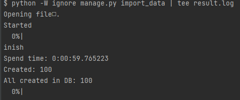
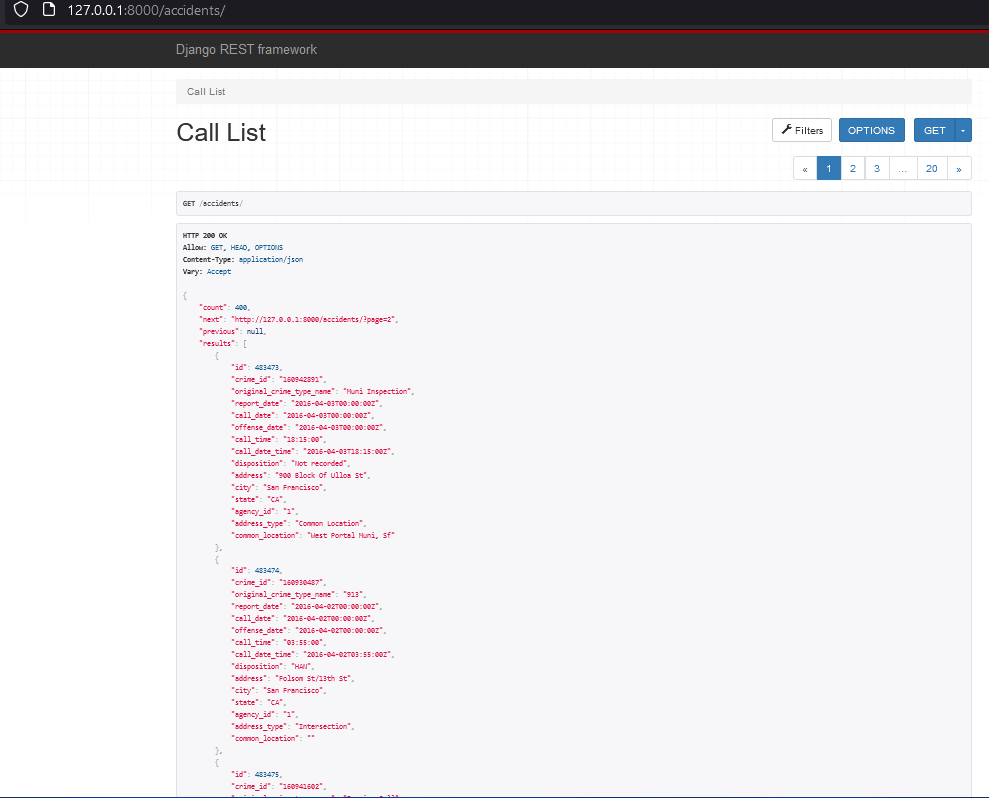
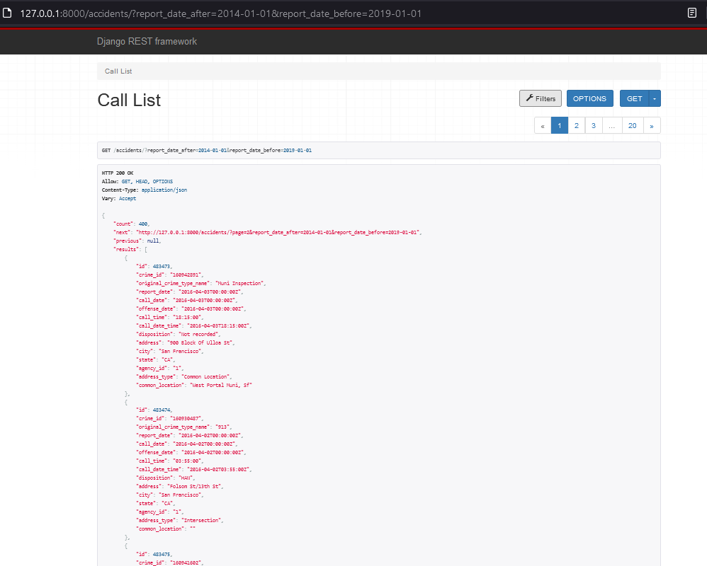

# Запуск проекта

* запускаем базу данных
    ```bash
    docker-compose up -d
    ```

* создать виртуальное окружение
    ```bash
    virtualenv venv
    ```
* активировать виртульное окружение
    ```bash
    source venv/bin/activate
    ```
* установить зависимости
    ```bash
    pip install -r req.txt
    ```
* Применяем миграции
    ```bash
    python manage.py migrate
    ```
* запуск Django
    ```bash
    python manage.py runserver
    ```

## Для сохранения данных из cvs файла в бд:

Скачиваем файл по [ссылке](https://gist.github.com/tm-minty/c39f9ab2de1c70ca9d4d559505678234/raw/8ecaee79b2c2cce88d60815aadeebb5ac209603a/police-department-calls-for-service.csv.zip), разархивируем и кладем сsv файл в корень проекта

### Запускаем команду
```bash
python -W ignore manage.py import_data | tee result.log
```
### Пример работы скрипта



*Логи будут сохранены в файле ```result.log``` (в корне проекта)

### Пример запроса без фильтрации

```
http://127.0.0.1:8000/accidents/
```


### Пример запроса с фильтрацией

```
http://127.0.0.1:8000/accidents/?report_date_after=2014-01-01&report_date_before=2019-01-01
```
